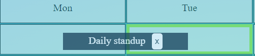

# Сalendar 
## follow this link and try [simple meeting calendar](https://nataliakoshevaya.github.io/calendar/dist/calendar.html)

Calendar consists of a pre-defined table with 5 days (Mon-Fri) for columns and 9 time slots (10:00-18:00, one hour long each) for rows. One meeting can take only 1 hour and obtain one cell in the Calendar screen.  

**The programme allows to:** 
 + Filter meetings for a particular team member. Button above the table\
   

 + Add new meetings by clicking button "Add new event+"\
 \
    This button transfer to the "Form" screen\
    \
    The meeting can be successfully created if and only if the time slot for that day and time is free. And also field "Name oif the event" and "Participants" filled. Otherwise the error bar will be shown.
    \
    \
    After successful creation of an event, the user transferred back to the “Calendar” screen where new event already be displayed. 
 + Delete meetings\
   User can delete meeting by clicking on button "x" in the filed with event.\
   
   
 + Change meeting day/time using drag and drop\
    =>  =>  
 

 
 
